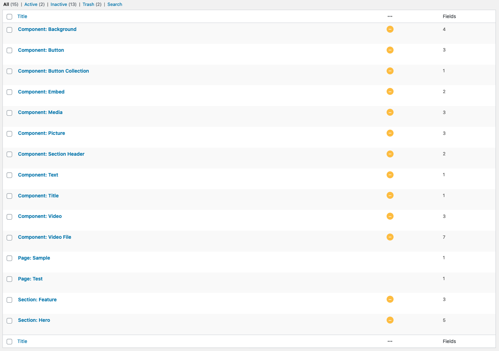

# Understanding ACF

## Overview

As the theme builds all pages dynamically around the Wordpress [ACF](https://www.advancedcustomfields.com/) data structure. It's important to understand how it is built in WordPress and how the GraphQL scheme looks on the Gatsby side.

> **Important note: you are not required to build the ACF data structure as part of the assignment - it is already provided for you.** This article is only meant to give you a basic reference on how things are built on the backend and delivered to the frontend.

## **ACF data structure in WordPress**

These are the basic building blocks the ACF has:

- [Components](#acf-components)
- [Sections](#acf-sections)
- [Pages](#acf-pages)



> _(Example of the specified ACF data structure in WordPress_)

### **ACF components**

Components are the most basic building block. In ACF they are represented as a simple field group with custom fields in it - typically basic ACF field types or other components as clones.

*They are to be set to inactive and only be used as clones within sections or other components.*

> **Naming convention**: `Component: [COMPONENT_NAME]` (e.g. `Component: Title`).

### **ACF sections**

Sections are custom field groups compiled of other [components](#acf-components) that represent a logical and visual section within your page. For example, the `Hero` section might be compiled by a `Title`, `Image` and `Button` components. Each field (component) should be a *Group* type that contains a *Clone* of the required component in a *Sub Field*.

*Similar to Components they are to be set to inactive and only be used as clones within pages.*

Example:

```markdown
Section: Hero [Field Group]
  - Title [Group]
     - Title [Clone of Component: Title]
  - Image [Group]
     - Image [Clone of Component: Image]
  - Button [Group]
     - Button [Clone of Component: Button]
```

> **Naming convention**: `Section: [SECTION_NAME]` (e.g. `Section: Hero`).

### **ACF pages**

Pages are custom field groups that contain only one field - `Sections`. The `Sections` fields should be a ***Flexible Content Field*** and should contain [sections](#acf-sections)' clones as *Layouts*.

> You should create only one *Page* field group for all pages so that all pages can be assigned with all sections. It is up to the user to decide which sections they would like to add to each page, and this way they can do it when creating pages in the WP editor.
>


> _(How to assign the Page field group to all page templates)_

**Example:**

```markdown
Page: All [Field Group]
  - Sections [Flexible Content Field]
     - Hero [Layout]
        - Hero [Clone of Section: Hero]
     - Feature [Layout]
        - Feature [Clone of Section: Feature]
```

**Naming convention:** `Page: [PAGE_NAME]` (e.g. `Page: All`).

---

## ACF data structure in GraphQL

The AirFleet Theme Plugin relies on the [Gatsby WordPress Source](https://www.gatsbyjs.org/packages/gatsby-source-wordpress/) plugin to structure the data scheme delivered from ACF and WordPress.

> After running `yarn develop` you can access the GraphiQL query tool at [http://localhost:8000/___graphql](http://localhost:8000/___graphql) to inspect the live data scheme from your connected WordPress site.

**A snippet of the query the theme uses to fetch all pages**

```graphql
query MyQuery {
  allWordpressPage {
    edges {
      node {
        # General page details
        id
        slug
        title
        content
        date
        ... # more general fields
				
        # All sections defined in ACF under the flexible content field
        children {
            __typename
            id
            # The theme injects each section's inline fragment into the page query automatically.
            # For Example:
            ... on WordPressAcf_hero {
                title
                text
                button {
                    label
                    link
                }
            }
        }
      }
    }
  }
}
```

**[< Previous](../README.md)** | **[Next: Building Components >](../pages/building-components.md)**